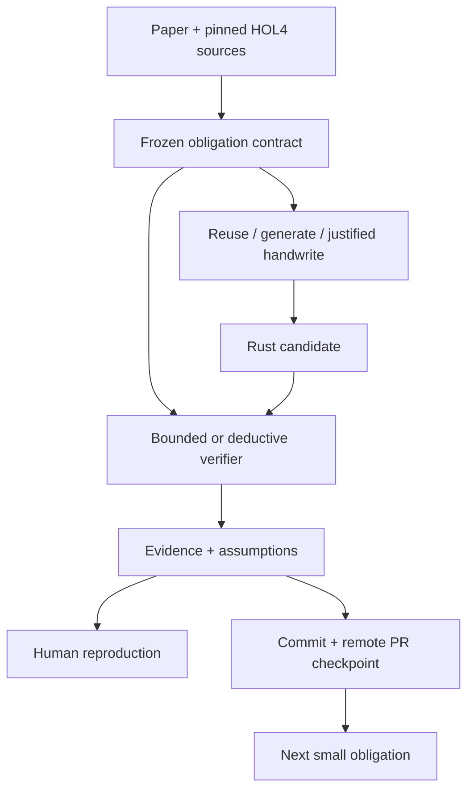

# ADR 0001 — Candle contract control plane

Status: accepted for the candle-rs branch. This record uses the concerns, viewpoints,
decisions and correspondence concepts of ISO/IEC/IEEE 42010; it is not a certification.

## Stakeholders and concerns

The owner needs a faithful Rust Candle implementation at low token cost. A solo human
supervisor needs reproducible evidence without trusting agent prose. Implementers need
small resumable work units and a stable mathematical oracle.

## Authority and scope

The ITP 2022 paper is the ultimate scientific reference. Pinned original HOL4 files
are its machine-readable contract, not an independently rewritten Rust specification.
The original CakeML/candle repository provides compatibility programs; CakeML/cakeml
contains the definitions and proofs. Pinning current source is not claiming that it is
the exact 2022 artifact. Record that version difference and resolve discrepancies
before accepting any affected refinement claim.

Aegis orchestrates Candle-rs development. It is not itself the Rust theorem prover.
Original soundness, a Rust refinement proof, bounded Kani results, Verus results,
compatibility observations, and end-to-end compiled-code soundness are distinct claims.

## Decision

Replace the generic TDD policy compiler, baseline gates, epoch engine and quality packs
with one Candle-specific contract pipeline. Reuse Aegis atomic writes, process capture,
path checks and locks. Retire obsolete entry points and release mirrors, with their
history preserved by Git. A single declarative contract produces compact work briefs
and verification plans. Evidence binds contract, original source identity, Rust source,
tool identity, invocation, coverage and limits. Completion requires a durable remote
checkpoint. Incomplete proofs can be checkpointed; they cannot be called proved.

## Runtime and information viewpoints

## Alternatives and consequences

Patching every generic TDD gate retains many irrelevant states and invalidates old
assurance claims piecemeal. A parallel opt-in Candle mode leaves bypasses and conflicting
policy. The replacement is smaller and easier to supervise, but intentionally removes
old CLI compatibility and old general-purpose release guarantees. Migration must say so.
Reusing low-level primitives saves work; their known platform limits remain in scope.

## Trust and outstanding work

HOL4 interpreter/proof environment and import closure must be supplied to replay original
specifications. Same bytes alone do not prove same interpretation. Rust adapters need an
explicit refinement argument; generated code is untrusted until verified. Aegis cannot
constrain arbitrary same-user shell writes, authenticate self-reported proof conclusions,
or prevent loss of edits made outside its checkpoint workflow. CI must run on the exact
PR head and human review must inspect changed contracts and tool adapters.
